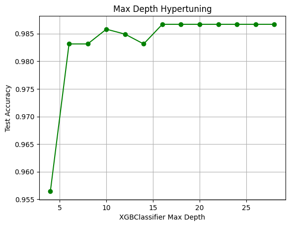

# Customer Churn Detection

This project aims to predict customer churn using various machine learning models. Churn prediction helps businesses identify customers who are likely to leave, allowing them to take proactive measures to retain these customers.

## Table of Contents
- [Project Structure](#project-structure)
- [Installation](#installation)
- [Explanation](#explanation)
  - [Data Preparation](#data-preparation)
  - [Model Training and Testing](#model-training-and-testing)
  - [Hyperparameter Tuning and Visualization](#hyperparameter-tuning-and-visualization)
- [Results](#results)
- [License](#license)

## Project Structure
```
customer_churn_detection/
│
├── data/
│   └── churn_data.csv
│
├── src/
│   ├── churn_detection.py
│   └── utils.py
│
├── images/
│   └── feature_importance.png
│
├── README.md
├── requirements.txt
└── LICENSE
```

- `data/`: Directory containing the dataset.
- `src/`: Directory containing the source code.
- `images/`: Directory to save generated plots and images.
- `README.md`: This file.
- `requirements.txt`: A list of Python dependencies required to run the project.
- `LICENSE`: The license under which the project is distributed.

## Installation

1. **Clone the repository:**
    ```bash
    git clone https://github.com/your-username/customer_churn_detection.git
    cd customer_churn_detection
    ```

2. **Install dependencies:**
    ```bash
    pip install -r requirements.txt
    ```

3. **Run the Customer churn Python Script**
   ```bash
   python customer-churn-detection.py
   ```

## Project Structure

- **Data Preprocessing**: We clean up the data, handle any missing values, and convert categorical variables (like "Gender" or "Payment Method") into a format that the machine learning models can use.
- **Model Training**: We train different machine learning models on our data to see which one predicts churn the best.
- **Model Evaluation**: We check how well the models are doing by looking at metrics like accuracy and confusion matrices.
- **Hyperparameter Tuning**: We fine-tune the best model to make it even better.

## Explanation

start by importing all the necessary libraries and tools that we would need for the project. This includes libraries for data handling (like Pandas and NumPy), for building and evaluating machine learning models (like Scikit-Learn and XGBoost), and for visualization (like Matplotlib and Seaborn).


### 1. Importing Libraries

```python
# Import all needed packages
from sklearn.pipeline import Pipeline
from xgboost import XGBClassifier
from sklearn.impute import SimpleImputer
from sklearn.preprocessing import StandardScaler, OneHotEncoder
from sklearn.compose import ColumnTransformer
from sklearn.ensemble import AdaBoostClassifier
import pandas as pd
import seaborn as sns
import statsmodels.formula.api as smf
import numpy as np
import statsmodels.api as sm
import matplotlib.pyplot as plt
from sklearn import metrics
from sklearn.model_selection import train_test_split
from sklearn.linear_model import LinearRegression
from sklearn.preprocessing import StandardScaler 
from sklearn.model_selection import cross_val_score
from sklearn.model_selection import RepeatedKFold
from sklearn.linear_model import Lasso
from numpy import absolute, mean, std
from sklearn.linear_model import Ridge
from sklearn.impute import SimpleImputer
from sklearn.preprocessing import OneHotEncoder
from sklearn.linear_model import LogisticRegression
from sklearn.metrics import accuracy_score, confusion_matrix
from sklearn.datasets import load_iris
from sklearn.model_selection import cross_val_score
from sklearn.tree import DecisionTreeClassifier
from sklearn.ensemble import RandomForestClassifier
```

## Data Preparation

### 2. Loading and Exploring the Dataset

Here, we loaded the dataset into a Pandas DataFrame. This allowed us to look at the first few rows to understand what the data looks like and what columns it contains.

```
# Load the dataset
df = pd.read_excel("./data/E Commerce Dataset.xlsx", sheet_name=1)
df.head()

```


### 3. Data Cleaning

Including a column like CustomerID could cause the model to overfit, meaning it would learn to "memorize" the training data rather than generalizing from it. This could lead to poor performance on new, unseen data because the model would have learned to rely on information that isn’t useful for prediction.so , remove the `CustomerID` column.

After removing , it's important to check for duplicate rows to ensure the data is clean. Duplicate rows can skew the results and lead to misleading conclusions, so identifying and removing them is an essential step in data preprocessing.

```python
# Remove unnecessary columns
df = df.drop(['CustomerID'], axis=1)

# Check for duplicate rows
df.duplicated().any()
```

**output**

```

Numerical columns:  ['Churn', 'Tenure', 'CityTier', 'WarehouseToHome', 'HourSpendOnApp', 'NumberOfDeviceRegistered', 'SatisfactionScore', 'NumberOfAddress', 'Complain', 'OrderAmountHikeFromlastYear', 'CouponUsed', 'OrderCount', 'DaySinceLastOrder', 'CashbackAmount']
Categorical columns:  Index(['PreferredLoginDevice', 'PreferredPaymentMode', 'Gender',
       'PreferedOrderCat', 'MaritalStatus'],
      dtype='object')
```


### 4. Feature Engineering

we categorized the columns into numerical and categorical types. This distinction is important because different preprocessing steps are required for each type before feeding the data into the model.

Feature selection is an important step in data preparation for machine learning. Here’s why it’s crucial:

Improves Model Performance: By selecting only the most relevant features, we help the model focus on important information, which can lead to better performance and more accurate predictions.

Reduces Overfitting: With fewer features, there’s less risk of the model learning noise or irrelevant patterns in the data, which can improve its ability to generalize to new, unseen data.

Speeds Up Training: Fewer features mean less data for the model to process, which can speed up the training process and make the model more efficient.

Simplifies the Model: A simpler model with fewer features is easier to understand and interpret, making it easier to explain the model’s decisions and results.

Minimizes Computational Costs: Working with fewer features reduces the computational resources required, which can be especially important with large datasets.

By carefully selecting the most impactful features, we ensure that our model is both effective and efficient.

```python
# Define numerical and categorical columns
cat_columns = df.select_dtypes(include="O").columns
num_columns = []
for col in df.columns:
    if col not in cat_columns:
        num_columns.append(col)

print("Numerical columns: ", num_columns)
print("Categorical columns: ", cat_columns)
```

**output:**

```
PreferredLoginDevice ['Mobile Phone' 'Phone' 'Computer']
PreferredPaymentMode ['Debit Card' 'UPI' 'CC' 'Cash on Delivery' 'E wallet' 'COD' 'Credit Card']
Gender ['Female' 'Male']
PreferedOrderCat ['Laptop & Accessory' 'Mobile' 'Mobile Phone' 'Others' 'Fashion' 'Grocery']
MaritalStatus ['Single' 'Divorced' 'Married']

```


### 5. Data Preprocessing

For the categorical columns, we first checked what unique values they contained. In some cases, we merged similar categories to simplify the data and also checked for any missing values that needed to be handled.

```python
# Look into the unique values of each categorical column
for col in cat_columns:
    print(col, df[col].unique())

# Merge categories in categorical columns
df.replace(['Mobile Phone', 'Credit Card', 'Mobile Phone'], ['Phone', 'CC', 'Mobile'], inplace=True)

# Check for NULL values
df.isna().sum()
```

**output:**


## Model Training and Testing


### 6. Model Training Function

Here we created a function called `train_and_test` that takes in the features (`X`), the target variable (`y`), and a classifier model, and then splits the data into training and testing sets. It also handles all the preprocessing steps, such as encoding categorical variables and scaling numerical ones. After training the model, it checks how well the model performs on both the training and testing data.

```python
# Define train_and_test function
def train_and_test (X, y, classifier, test_size, enable_print = True): 
    # Get categorical and numerical columns
    cat_columns = X.select_dtypes(include="O").columns
    num_columns = []
    for col in X.columns:
        if col not in cat_columns:
            num_columns.append(col)
    
    # Encode categorical columns using OneHotEncoder
    categorical_col = Pipeline(steps=[
          ('encoding', OneHotEncoder())
      ])
    
    # Fill numerical NULL values with the mean value of the relevant column
    numerical_col = Pipeline(steps=[
          ('imputer', SimpleImputer(strategy="mean")),
          ('scaler', StandardScaler())
      ])
    
    # Transform data
    transformer = ColumnTransformer(transformers=[
        ('categorical_col', categorical_col, cat_columns),    
        ('numerical_col', numerical_col, num_columns)
      ])
    
    # Create model
    model = Pipeline([
          ('transformer', transformer),
          ('classifier', classifier)
      ])
​
    # Prepare training and testing data
    X_train, X_test, y_train, y_test = train_test_split(X, y, test_size=test_size, random_state=42)
​
    # Fit the model
    model.fit(X_train, y_train)
    
    # Calculate the training data accuracy and confusion matrix
    pred = model.predict(X_train)
    accuracy = accuracy_score(y_train, pred)
    matrix = confusion_matrix(y_train, pred)
    if enable_print:
        print('Train confusion matrix:\n', matrix)
        print('Train accuracy: ', accuracy * 100, '%')
​
    # Calculate the testing data accuracy and confusion matrix
    pred = model.predict(X_test)
    accuracy = accuracy_score(y_test, pred)
    matrix = confusion_matrix(y_test, pred)
    if enable_print: 
        print('Test confusion matrix:\n', matrix)
        print('Test accuracy: ', accuracy * 100, '%')
        print("=====================================================================")
  
    return accuracy
```

### 7. Preparing Data for Model Training

Here, I separated the dataset into features (`X`) and the target variable (`y`), which is `Churn`. The test size is set to 20% of the data, meaning 80% is used for training and 20% for testing.you can feel free change the test size accroding for your own testing and learning purposes.Here I take the test size `0.2`

```python
# Prepare X and y
X = df.drop(columns=["Churn"])
y = df["Churn"]
test_size = 0.2
```

### 8. Model Training and Evaluation

In this section, we trained and evaluated three different types of classifiers to predict customer churn. Each classifier was tested to see how well it could identify customers who are likely to churn.

1. **Logistic Regression:**

- Logistic Regression is a simple yet effective model for binary classification problems (e.g., churn vs. no churn). It calculates the probability that a customer will churn based on the input features.

- you can learn more about Logistic Regression in here [Logistic Regression - scikit-learn Documentation](https://scikit-learn.org/stable/modules/linear_model.html#logistic-regression)

2. **Decision Tree Classifier**:
   -  The Decision Tree Classifier makes predictions by splitting the data into branches based on feature values, creating a tree-like structure. It’s good at handling both numerical and categorical data and provides clear decision rules.
   -   Decision Tree Classifier, which creates a model based on a tree structure to decide whether a customer will churn. Here we take the random state `random_state=42` ensures that the results are reproducible. The model’s accuracy and confusion matrix are then printed.
   -  [Decision Tree Classifier - scikit-learn Documentation](https://scikit-learn.org/stable/modules/tree.html#classification)

3. **XGBoost Classifier**:
   -  XGBoost (Extreme Gradient Boosting) is an advanced machine learning algorithm known for its high performance and accuracy. It builds multiple decision trees sequentially to improve predictions and handle complex patterns in the data.
   -   XGBoost model, which is typically very effective for classification tasks. The `XGBClassifier()` uses default settings to start, and its performance is evaluated and printed.
   -    [XGBoost - Official Documentation](https://xgboost.readthedocs.io/en/latest/)

```python
# Logistic Classifier
print("========================== Logistic Classifier ==========================")
model = train_and_test(X, y, LogisticRegression(solver='liblinear'), test_size)

# Decision Tree Classifier
print("========================== DecisionTreeClassifier ==========================")
model = train_and_test(X, y, DecisionTreeClassifier(random_state=42), test_size)

# XGBClassifier
print("========================== XGBClassifier ==========================")
model = train_and_test(X, y, XGBClassifier(), test_size)
```
**output**:

```
========================== Logistic Classifier ==========================
Train confusion matrix:
 [[3623  118]
 [ 377  386]]
Train accuracy:  89.00976909413855 %
Test confusion matrix:
 [[925  16]
 [ 81 104]]
Test accuracy:  91.3854351687389 %
=====================================================================
========================== DecisionTreeClassifier ==========================
Train confusion matrix:
 [[3741    0]
 [   0  763]]
Train accuracy:  100.0 %
Test confusion matrix:
 [[928  13]
 [ 17 168]]
Test accuracy:  97.33570159857904 %
=====================================================================
========================== XGBClassifier ==========================
Train confusion matrix:
 [[3741    0]
 [   0  763]]
Train accuracy:  100.0 %
Test confusion matrix:
 [[938   3]
 [ 16 169]]
Test accuracy:  98.3126110124334 %
```


## Hyperparameter Tuning and Visualization

### Tuning the Model

```python
# Tree max depth hypertuning
max_depth = []
accuracies = []

for i in range(4, 30, 2):
    grid = {'max_depth': i}
    clf = XGBClassifier()
    clf.set_params(**grid)
    accuracy = train_and_test(X, y, clf, test_size, False)
    
    max_depth.append(i)
    accuracies.append(accuracy)

plt.plot(max_depth, accuracies, marker='o', linestyle='-', color='green')
plt.title("Max Depth Hypertuning")
plt.xlabel("XGBClassifier Max Depth")
plt.ylabel("Test Accuracy")
plt.grid(True)
plt.show()

```



# Learning rate hypertuning

```
learning_rates = []
accuracies = []

for i in range(0, 10, 1):
    eta = i / 10
    grid = {'max_depth': 12, 'eta': eta}
    clf = XGBClassifier()
    clf.set_params(**grid)
    accuracy = train_and_test(X, y, clf, test_size, False)
    
    learning_rates.append(i)
    accuracies.append(accuracy)

plt.title("Learning Rate hypertuning")
plt.xlabel("XGBClassifier Learning Rate")
plt.ylabel("Test Accuracy")
plt.plot(learning_rates, accuracies, 'b')
plt.grid()

```


# Number of estimators hypertuning

```
n_estimators = []
accuracies = []

for i in range(1, 1000, 50):
    grid = {'max_depth': 12, 'eta': 0.4, 'n_estimators': i}
    clf = XGBClassifier()
    clf.set_params(**grid)
    accuracy = train_and_test(X, y, clf, test_size, False)
    
    n_estimators.append(i)
    accuracies.append(accuracy)

plt.title("Number of estimators hypertuning")
plt.xlabel("XGBClassifier Number of estimators")
plt.ylabel("Test Accuracy")
plt.plot(n_estimators, accuracies, 'g')
plt.grid()
```


# Final model with the hypertuned params
```
print("========================== XGBClassifier with hypertuned params ==========================")
grid = {'max_depth': 16, 'eta': 0.4, 'alpha': 0, 'lambda': 1, 'n_estimators': 400}
clf = XGBClassifier()
clf.set_params(**grid)
accuracy = train_and_test(X, y, clf, test_size)
```

**output:**
```
========================== XGBClassifier with hypertuned params ==========================
Train confusion matrix:
 [[3741    0]
 [   0  763]]
Train accuracy:  100.0 %
Test confusion matrix:
 [[940   1]
 [ 12 173]]
Test accuracy:  98.84547069271758 %
=====================================================================
```

## Results

This chart helps us understand the proportion of males and females in our dataset. Each slice of the pie represents the percentage of each gender among the customers.


This chart shows how churn rates (i.e., the number of customers who have canceled) differ between genders. Each bar represents a gender, and the colors (red for churned and green for not churned) show how many customers of each gender have churned or not.


 This chart shows how different types of products are associated with churn. Each bar represents a type of product, and the colors (red for churned and green for not churned) indicate how many customers who used that product type have churned or not.
 


   
